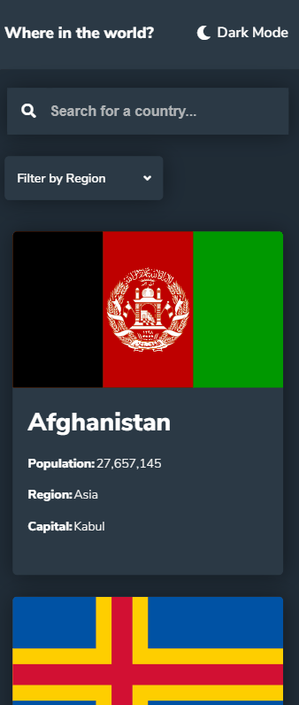

# Frontend Mentor - REST Countries API with color theme switcher

## Welcome! 👋

Thanks for checking out this front-end coding project.

The design reference was provided to me by [Frontend Mentor](https://www.frontendmentor.io) , a site that hosts challenges that allow you to improve your skills in a real-life workflow.

## The Objective

To integrate with the [REST Countries API](https://restcountries.eu) to pull country data and display it like in the designs.

Users should be able to:

- See all countries from the API on the homepage
- Search for a country using an `input` field
- Filter countries by region
- Click on a country to see more detailed information on a separate page
- Toggle the color scheme between light and dark mode

## What I learned

A lot of road blocks where met during the course of building out this project, however these weaknesses have got a boost in improvement and has given me more confidence as a Junior Front-End Developer.

These improvements are some the following: 

- Using React with a RESTful API
- Using React with CSS styles 
- Responsive CSS layouts for multiple Desktop windows and Mobile Users
- Using Context from React
- Building out component heirarchies 
- Planning out and executing an application build (this is the biggest App I have built alone, thus far)

Lastly this project has given me more hours to work with React code, solving/debugging issues, and loading data from a RESTful API.

